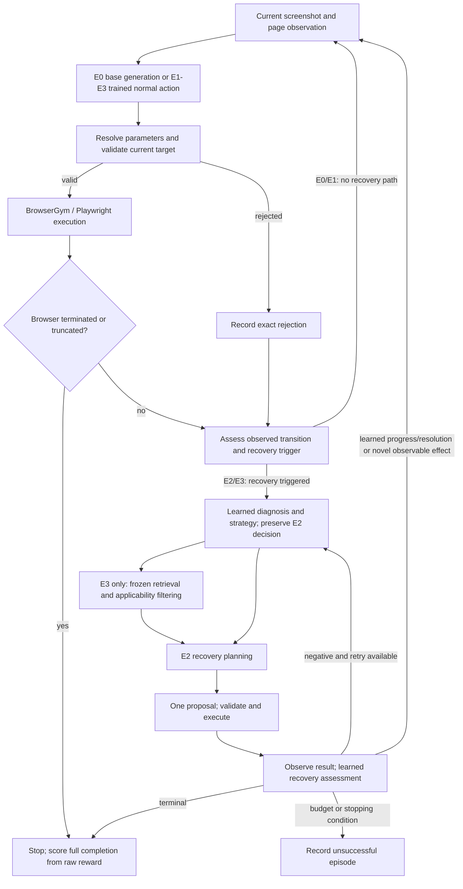

# Table 2 solver handoff: aim, implementation, evidence and remaining failures

> **Latest, 2026-09-13:** the hybrid v3 implementation and 24-episode development
> check are complete (456 focused tests, audit PASS). H0–H3 each completed 2/6;
> recovery execution improved, completion did not. Read the
> [v3 result and remaining limits](TABLE2_HYBRID_INTERFACE_V3.md) and
> [current TODO](TABLE2_HYBRID_AGENT_TODO.md) before the historical E-system
> handoff below. Models and memory remain frozen; no evaluation is running.

Prepared 2026-09-12 for another agent working in the existing lab repository.
Read this first, then the linked source and evidence. This document describes
the current development state; older WebArena plans are superseded.

Latest proposed work is specified in the
[H0–H3 hybrid-agent implementation plan](TABLE2_HYBRID_AGENT_IMPLEMENTATION_PLAN.md)
and [ordered TODO](TABLE2_HYBRID_AGENT_TODO.md).
**Latest final outcome, 2026-09-13:** [all 120 H-study episodes completed](TABLE2_HYBRID_FINAL_RESULTS_V1.md)
with audit PASS, 30 eligible pairs and no infrastructure errors. H0 8/30;
H1/H2/H3 9/30 each. Neither primary contrast improved completion (Holm p=1.0).
Both H3 queries abstained; no memory context or recovery action executed in this
final run. The job is stopped and all seven tasks are complete. Readiness/pending
statements below are historical. No unchanged rerun is needed.
**Latest execution readiness:** the [separate final runner](TABLE2_HYBRID_FINAL_RUNNER_V1.md)
passed its checks and froze all 30 eligible blocks / 120 episodes. No final episode
has run. The next task is to execute that package and report both contrasts.
The pending-launch statements below are historical; the agent itself is unchanged.
**Current protocol update, 2026-09-13:** the user approved the
[final selective-memory protocol](TABLE2_HYBRID_FINAL_PROTOCOL_V1.md), accepting
verified memory abstention without claiming memory delivery or benefit. Thirty
new task/reset blocks / 120 planned episodes are frozen. The audited v2 agent
and prompts remain unchanged. Protocol scope is ready; execution launch awaits
its dedicated binding/checks because current H launchers are development-only.
The readiness statements below describe historical decisions under the old gate.
**Subsequent bounded diagnosis:** [eight saved-state planner calls](TABLE2_HYBRID_PLANNER_PROBE_V1.md)
completed; all three baselines reproduced. History reformatting fixed one malformed
response but retained a repeated action. Neither tested intervention produced TYPE
or fixed stale sequence targets. No runtime change or new live episode followed;
the memory-coverage/claim decision remains open before final evaluation.
**Latest update, 2026-09-13:** [v2 live development](TABLE2_HYBRID_DEVELOPMENT_V2.md)
completed all 24 episodes with audit PASS; H0/H1/H2/H3 each completed 2/6.
H2/H3 executed one recovery each, received negative assessment and continued.
H3 made six queries but admitted no memory examples. All 44 H2/H3 generation
pairs match, confirming the context correction in this run. No TYPE executed.
Final readiness remains false under the memory-exposure gate. The run has exited;
review its planning failures and memory abstentions before any next study.
The v1 diagnosis and outcomes below remain historical; preserve their evidence.
[Tasks 1–6 are complete](TABLE2_HYBRID_DEVELOPMENT_V1.md). On 2026-09-13, all
24 frozen H development episodes ran and the execution-evidence audit passed:
H0 1/6, H1 1/6, H2 1/6, H3 0/6. Only six clicks executed from 562 requests;
there was no typing, recovery, continuation or memory query. **Final H readiness
is false.** A live input-isolation defect exposes system IDs and timing-dependent
decision hashes to the generator before memory. Its effect on decisions has not
been separately tested; H3's lost completion cannot be attributed to memory.
Read the linked Task 6 report before acting. Next: correct that context boundary
and test paired prompt equality; preserve all frozen outputs at
`/home/aiub/kiyas/table2-evidence/miniwob-hybrid-dev-v1`.
The model/browser run exited normally. Recheck jobs before future inference.
Final H evaluation remains pending. Historical E findings below are unchanged.
This declares trained pre-action outputs advisory and browser control resolution
explicit; it does not relabel or replace the historical E0–E3 evidence below.
The [earlier completion plan](TABLE2_AGENT_COMPLETION_PLAN.md) is superseded for
forward implementation.

> **Status update, 2026-09-12 (later session).** Both named failures have been
> traced. The overlapping-target rejection was an implementation defect and is
> fixed and verified; skipped preparation is a model choice, and the prompt was
> not changed. A matched `miniwob-development-v6` run completed with a PASS
> audit: the model's chosen control now executes where it previously could not,
> and **task completion did not change** (E0 1/4, E1 0/4, E2 2/4, E3 2/4).
> Multi-step continuation remains undemonstrated for a structural reason
> recorded in the results. Final evaluation readiness remains **false**. Read
> [the diagnosis](TABLE2_OVERLAPPING_TARGET_DIAGNOSIS.md) and
> [the development-v6 results](TABLE2_DEVELOPMENT_V6.md) before section 6 or 10
> below, which describe the state prior to that work.

**Immediate task:** investigate the remaining planner and target-validation
failures using the existing frozen model. Establish actual multi-step recovery
on development tasks before another final evaluation. Do not assume every poor
prediction is an implementation bug, or that an engineering PASS proves benefit.

## 1. Research aim and experimental meaning

Our thesis studies a four-pillar failure-aware multimodal browser agent. Table 2
asks two questions under matched tasks, resets and execution budgets:

1. Does **executed failure diagnosis and recovery** increase task completion?
2. Does **frozen train-only corrective memory** add improvement over that recovery
   system?

The intended outcome is a correctly implemented, measurable four-pillar system.
The measured results must determine whether it improves. Do not manufacture a
positive result, replace model actions with task solutions, or select a new
method based on the completed final evaluation's outcomes.

| System | Actual role | Main comparison |
|---|---|---|
| E0 | Frozen unadapted Qwen base generates browser-action JSON | Contextual baseline |
| E1 | Frozen trained PC-01 multimodal policy predicts action class and grounding: P2/P3 | Trained-policy baseline |
| E2 | E1 plus learned failure diagnosis, strategy selection, executed recovery and learned assessment: P1 | E2 minus E1: recovery increment |
| E3 | E2 plus frozen train-only retrieval and advisory recovery context: P4 | E3 minus E2: memory increment |

E0's generated-action interface differs from E1's trained action-head interface.
The design does not independently isolate the performance contribution of each
of the four pillars. Keep that limitation explicit in thesis claims.

## 2. All four pillars and how they execute

| Pillar | Required purpose | Current execution | Evidence and limits |
|---|---|---|---|
| **P1: failure-aware resilience** | Detect/diagnose failure, decide on recovery, select a strategy, execute it and assess its outcome | The trained checkpoint assesses the action-conditioned transition. The controller selects/validates the recovery strategy. For generated recovery, a frozen base generator proposes one concrete action; the browser executes it and the trained checkpoint assesses the resulting transition. | Diagnosis and assessment remain active. Strategy prediction alone is not executed recovery. A browser action can execute successfully while the learned recovery assessment stays negative. |
| **P2: multimodal decision** | Use screenshots and task/page information with correct temporal separation | The registered processor and trained policy consume their unchanged inputs. Generated action/parameter/recovery interfaces also receive current observed controls, task context and causal completed-action history. | Preserve pre-action, post-action and post-recovery boundaries. Never provide future observations, evaluator answers or reward to the planner. |
| **P3: multi-tool action and grounding** | Choose an action class and ground it in the current page | Six actions remain: CLICK, TYPE, SELECT, SCROLL, NAVIGATE, PRESS_KEY. The interface resolves a current control ID, unique observed name or predicted coordinates, validates capabilities/parameters, then executes through BrowserGym/Playwright. | Preserve the selected action and issued value. No automatic TYPE insertion, SELECT-to-CLICK replacement, silent coordinate repair or invented URL. Overlapping target geometry is currently an unresolved rejection case. |
| **P4: corrective memory** | Retrieve useful past corrective experience and permit a measured recovery intervention | E3 first preserves the complete no-memory E2 decision. Its trained representation queries the frozen 1,974-vector index using cosine top-three retrieval and the fixed threshold. Applicable admitted examples enter recovery generation as advisory context. | The actual material is **training-label-backed**, not a set of complete successful browser-recovery trajectories. Goals/domains and labels are available; corrective values and reflections are null. Context delivery is verified; completion benefit is not demonstrated. |

The generation route is important: E1 uses the trained action/grounding heads;
E2/E3 generated recovery uses the frozen **unadapted base** generator, conditioned
on learned diagnosis/strategy and current context. The trained checkpoint is
still responsible for diagnosis, assessment and E3 query representation. Do not
describe all recovery text generation as output from the trained action head.

## 3. Browser stack and episode loop

**Playwright is already in use.** BrowserGym supplies the environment wrapper;
MiniWoB supplies browser tasks and rewards; Playwright controls Chromium.
Changing to Playwright is not a missing setup step.

The diagram summarizes the path; source code defines exact gates and stopping
conditions. Parsing/validation failures feed the next budget-permitted attempt
in the same incident. A terminated failed form cannot be repaired by continuing
to act after termination.

## 4. What has been implemented and verified

- The lab loads and runs the existing checkpoint and pinned base. The earlier
  laptop OOM is not the cause of the current low browser completion rate.
- The control projection includes observation-bound IDs, associated/qualified
  sibling labels, accessible names, placeholders, role, boxes, capabilities and
  checked/selected/focused/disabled/read-only state. Visible text and input value
  are separate. Ambiguous labels remain ambiguous.
- Action parsing preserves one action and its value. Target/parameter validation,
  coordinate handling, temporal history and feedback have regression coverage.
- Recovery history contains completed actions, exact issued targets/values,
  execution outcomes and preceding rejection details. Learned diagnosis, strategy
  selection and post-recovery assessment stay active.
- A separate development profile introduced clearer six-action planning
  instructions, preparation-before-submission guidance and bounded continuation
  after observable action effects. It does not insert task solutions.
- Observable continuation requires a stable control and a new verifiable state:
  exact visible text insertion, changed selected option or checkbox/radio state.
  Focus alone, screenshot change and cycling back to a seen state earn no credit.
  It is separate from learned success and from evaluator reward. Masked password
  values currently cannot earn exact-text effect credit.
- Memory retrieval/order/threshold and context delivery have been replayed.
  Selective context excludes missing required arguments, unsupported BACKTRACK,
  repeated unresolved actions and incompatible controls/destinations. Empty
  context preserves the complete E2 decision. Missing values remain null.
- **140 focused tests passed**, including after the latest audit correction.
  A real Playwright fixture and a scripted complete-controller fixture verified
  intermediate progress with negative learned assessment. These fixtures made
  no model calls and are not live performance results.
- All 16 new development episodes ran. Their corrected evidence audit passed.
  The original failed audit remains preserved: it incorrectly treated redacted
  control metadata as raw input. The corrected auditor hash-verifies the raw
  observation before replaying capability checks. No episode was rerun.
- The previous 120-episode archive's 2,353 bound files and the user's notebook
  were verified unchanged at the end of the implementation session.

## 5. Actual results: keep the studies separate

| Study | Episodes | E0 | E1 | E2 | E3 |
|---|---:|---:|---:|---:|---:|
| Historical 24-episode full-credit study | 24 | 0/6 | 0/6 | 1/6 | 1/6 |
| Completed interface-v2 evaluation | 120 | 6/30 | 0/30 | 6/30 | 6/30 |
| Previous accepted matched development, r2 | 16 | 1/4 | 0/4 | 1/4 | 1/4 |
| Latest development-v3 revision | 16 | 1/4 | 0/4 | 2/4 | 2/4 |

The 120-episode evaluation has 30 eligible matched pairs, no infrastructure
failures or exclusions. E2−E1 was +0.20, exact p=0.03125, Holm p=0.0625;
E3−E2 was 0, p=1. Neither contrast met the approved adjusted 5% criterion.

Latest development: E2 and E3 both completed `click-button` and `click-test`.
Both failed `enter-text` and `click-button-sequence`. This small development
change does not replace the 120-episode result or establish a general gain.

## 6. Remaining problems, with evidence rather than assumed causes

| Problem | Verified observation | Interpretation / investigation boundary |
|---|---|---|
| Preparation is skipped | Latest E2 and E3 each generated five recovery proposals, all CLICK. Both clicked Submit on `enter-text` without typing. | The model does not reliably choose the needed preparation action despite the clearer prompt. Inspect the exact prompt, screenshot, control context and raw response. Do not claim a lost TYPE action when none was generated. |
| Overlapping controls rejected | All four sequence recovery proposals failed parameter resolution with `TARGET_POINT_MATCH_COUNT:2`. Both button boxes contain the proposed center. | `validate_control_action()` counts geometric box intersections. Investigate actual browser hit target, occlusion and selected-control identity. Preserve the model's chosen control; do not make a wrong button succeed through automatic replacement. |
| New continuation has no live exercise | Six recovery actions executed and six learned assessments were negative; zero observable effects or continuations were recorded. | Engineering tests pass, but live multi-step continuation has not been demonstrated because the model did not produce a qualifying intermediate action. |
| Learned assessment is persistently negative | All 54 assessments in the 120-episode run and all six in latest development were negative. | `predicted_progress` and `predicted_failure_resolved` derive from the same learned outcome probability. They are not two independent heads. Terminal scoring still counts actual full completions. Do not change head thresholds silently. |
| E1 cannot act effectively | In the 120-episode run, all 90 E1 normal proposals were NAVIGATE without a permitted URL; none executed. Latest development remained 0/4. | Existing parity checks preserve these predictions. Poor benchmark transfer is plausible; the exact cause is not established. Masking NAVIGATE or substituting another actor changes E1. |
| Memory lacks useful corrective content | All 1,974 records lack corrective action values and reflection text. Saved training memory accuracy measures storage decisions, not retrieval utility. | Source goals/domains and labels are delivered, but do not supply verified correction sequences or missing values. Do not fabricate them or reopen the dataset review. |
| Selective memory still adds no completion | Latest E3 had five queries and five generation exposures. Ten candidate occurrences were excluded; one CLICK example remained in all five contexts. Zero complete abstentions occurred live. | The filter works as implemented but is only a necessary applicability check. It does not guarantee relevance. E2 fallback is fixture-tested; zero E2/E3 completion difference remains the live finding. |

The legacy audit field `live_path_verified: true` only establishes recovery
execution, assessment and memory exposure. It is **not** sufficient readiness
evidence for the newly introduced continuation behavior. The latest separate
`development-readiness.json` correctly records final readiness as false.

## 7. Source map for the next agent

| File | What to inspect |
|---|---|
| [miniwob_study.py](../src/web_agent/eval/table2/miniwob_study.py) | Frozen profile, budgets, serial runner, system wiring, E2/E3 planner construction and artifact checks |
| [miniwob_model.py](../src/web_agent/eval/table2/miniwob_model.py) | Existing checkpoint/base loading and shared parameter provider |
| [qwen2vl_pc01.py](../src/web_agent/runtime/qwen2vl_pc01.py) | Trained predictions, processor/parity, generation settings and assessment mapping |
| [model.py](../src/web_agent/models/model.py) | Trained heads and query representation; understand without redesigning or retraining |
| [causal_recovery_planner.py](../src/web_agent/runtime/causal_recovery_planner.py) | Exact recovery context, prompt assembly, history, rejection feedback and generation |
| [v3 prompt](../configs/eval/table2/miniwob_recovery_prompt_v3.txt) | Current six-action instructions and preparation guidance |
| [named_target_policy.py](../src/web_agent/runtime/named_target_policy.py) | Four-field response parsing and current target resolution |
| [action_parameters.py](../src/web_agent/runtime/action_parameters.py) | Concrete parameters, deterministic validation and frozen base fallback |
| [miniwob_controls.py](../src/web_agent/benchmarks/miniwob_controls.py) | Projection, shared capabilities and overlapping-point rejection |
| [browsergym_miniwob.py](../src/web_agent/benchmarks/browsergym_miniwob.py), [miniwob_worker.py](../src/web_agent/benchmarks/miniwob_worker.py) | Browser subprocess, action code, execution-time revalidation and raw outcomes |
| [episode.py](../src/web_agent/runtime/episode.py), [controller.py](../src/web_agent/runtime/recovery/controller.py), [strategies.py](../src/web_agent/runtime/recovery/strategies.py) | Incidents, retries, continuation, learned assessment and stopping |
| [observable_progress.py](../src/web_agent/runtime/observable_progress.py) | New opt-in effect/novelty rule; limitations including masked passwords |
| [label_runtime.py](../src/web_agent/memory/label_runtime.py), [context_applicability.py](../src/web_agent/memory/context_applicability.py) | E3 query/admission, E2 shadow preservation and selective context |
| [label_backed_store.py](../src/web_agent/memory/label_backed_store.py), [label_experience.py](../src/web_agent/memory/label_experience.py) | Frozen vectors and actual available source material |
| [miniwob_reporting.py](../src/web_agent/eval/table2/miniwob_reporting.py) | Raw full-completion scoring, paired analysis and independent evidence replay |
| [test_development_v3.py](../tests/table2/test_development_v3.py), [test_miniwob_interface_v2.py](../tests/table2/test_miniwob_interface_v2.py) | Relevant regression fixtures; also inspect adjacent recovery/memory tests |
| [check_miniwob_progress_v3.py](../scripts/check_miniwob_progress_v3.py) | Real-browser engineering fixture, not a model efficacy test |

## 8. Documents and evidence to read

Read in this order:

1. [Latest implementation and development results](TABLE2_DEVELOPMENT_V3.md).
2. [Whole-loop diagnosis](TABLE2_WHOLE_LOOP_DIAGNOSIS.md), based on the older 120-run.
3. [P4 usefulness diagnosis](TABLE2_P4_USEFULNESS_DIAGNOSIS.md).
4. [Completed 120-episode results](TABLE2_MINIWOB_INTERFACE_V2_RESULTS.md) and
   [interface-v2 implementation](TABLE2_MINIWOB_INTERFACE_V2_IMPLEMENTATION.md).
5. [Next lab session](TABLE2_NEXT_LAB_SESSION.md) and
   [remaining checklist](TABLE2_REMAINING_EXECUTION_CHECKLIST.md): current status
   banners override their historical sections.
6. [Original handoff](TABLE2_UNIVERSITY_LAB_AGENT_HANDOFF.md) and
   [compatibility runbook](PC01_CHECKPOINT_COMPATIBILITY_RUNBOOK.md) for artifact
   provenance. Their old WebArena setup and old N/R statuses are historical.

Evidence root: `/home/aiub/kiyas/table2-evidence/`.

| Directory | Contents |
|---|---|
| `miniwob-development-v3/` | All 16 actual episodes, frozen plan, exact producing source snapshot, prompts/raw responses, observations, event logs and original failed audit |
| `miniwob-development-v3-audit-r2/` | Corrected PASS audit, auditor sources, development diagnostics, readiness record and hashes |
| `miniwob-development-v3-engineering/` | 140-test logs, browser/controller fixtures, source baseline and preservation evidence |
| `miniwob-interface-v2-evaluation/` | Immutable completed 120-episode evaluation |
| `miniwob-interface-v2-development-r2/` | Previous accepted 16-episode matched development baseline |
| `miniwob-interface-v2-loop-diagnosis/` | Saved whole-loop summaries and traces |
| `miniwob-interface-v2-p4-diagnosis-complete/` | Completed memory-delivery/usefulness diagnosis |

For the latest failures, start with
`miniwob-development-v3/{enter-text,click-button-sequence}/repeat-0/{E2,E3}/`:
`observation-2.json`, its screenshot, `named-recovery-outputs/output-*.json`,
`runtime/recoveries.jsonl`, `runtime/actions.jsonl`, and `browser-outcomes.json`.
Read the serialized generation context as well as the raw response; do not infer
what the model saw from the prompt template alone.

## 9. Environment and frozen assets

- Repository: `/home/aiub/kiyas/webagent`; branch `Code`; HEAD at this handoff:
  `ca10c72aad52bf60a5e2c5e8b6c8f9e5a9dd1e1e`. The worktree contains substantial
  uncommitted/untracked work. HEAD alone does not identify the executed profile.
- Model Python: repository `.venv/bin/python`; browser Python:
  `/home/aiub/kiyas/table2-envs/miniwob-feasibility/bin/python`.
- Browser stack: BrowserGym 0.14.3, Playwright 1.44.0, Gymnasium 1.0.0; ARM64 lab.
- Browser binaries: `/home/aiub/kiyas/table2-inputs/miniwob-browsers`.
- MiniWoB source: `/home/aiub/kiyas/table2-inputs/miniwob-plusplus`.
- Model: PC-01 epoch 6, seed 42. Checkpoint under
  `/home/aiub/kiyas/webagent_comparison/outputs/model_comparison/qwen2vl_2b_gold_v2_8_dgx/seed_42/full/checkpoints/Y_QWEN2VL_2B_GOLD_V2_8_DGX_FULL_SEED42/best_e6_outcome-mcc0.624.ckpt`.
- Export: `/home/aiub/kiyas/table2-inputs/pc01-epoch6-seed42-full-v3`.
- Base: `/home/aiub/kiyas/table2-inputs/Qwen2-VL-2B-Instruct/snapshots/895c3a49bc3fa70a340399125c650a463535e71c`.
- Store: `/home/aiub/kiyas/table2-evidence/p4-local-embeddings-v1`; 1,974 × 768
  normalized vectors; cosine top three; threshold `0.7371385097503662`.
- Material: `/home/aiub/kiyas/table2-evidence/p4-local-label-memory-v1/memory-items.jsonl`.
- Exact dependencies, report/run-contract paths, hashes and bindings are in
  [the development configuration](../configs/eval/table2/miniwob_development_v3.json)
  and the saved `plan.json`. Validate those identities before inference.

The completed development run and its browser workers stopped at the last
session check. Recheck active jobs/GPU use; do not assume the machine stayed idle.

## 10. Bounded next work and constraints

1. **Resume safely.** Inspect current changes/jobs and read the latest raw failure
   traces. Preserve notebook edits, unrelated work and every completed archive.
2. **Investigate the two concrete failures separately.** Trace missing TYPE from
   assembled prompt through raw generation; trace overlapping target identity
   through resolver, parameter validator and browser hit testing. Distinguish
   demonstrated code defects from model choices and untested hypotheses.
3. **Make a minimal, declared development change.** Any target repair must execute
   the same model-selected control and action. A planner change must let the
   model supply the action/value. Keep learned diagnosis/assessment active.
4. **Test regressions before live inference.** Cover overlapping/occluded targets,
   exact values, stale state, bounded continuation, E2/E3 isolation and read-only
   memory. Use current observed DOM only; no evaluator/task-answer shortcuts.
5. **Use a new frozen development profile/output.** Do not relaunch or overwrite
   the completed v3 package. Its original engineering receipt and producing
   sources are immutable; audit-only corrections are separately recorded. Keep
   existing development tasks/resets/budgets matched and retain all failures.
6. **Demonstrate actual multi-step execution.** Record a model-chosen preparation
   action, its visible effect, negative/positive learned assessment separately,
   and budget-permitted continuation. Compare E2/E3 outcomes and memory exposure.
   Do not call a scripted sequence a live model success.
7. **Report readiness honestly.** Another final run is currently premature.
   Diagnose named remaining defects; do not demand a positive result as an audit
   gate. If the method changes again, document and freeze it before evaluation.

Existing development tasks: `click-button`, `enter-text`, `click-test`,
`click-button-sequence`; four systems, one matched reset per family. Fixed budgets:
30 executor requests, two recovery attempts per incident, four per episode,
102 model calls and 600 seconds. Model seed remains 42.

The completed evaluation used six families (`click-link`, `click-option`,
`click-checkboxes`, `enter-password`, `login-user`, `focus-text`), five resets each,
four systems: 120 episodes, subject to whole-block overlap exclusion. These are
previously observed families, not a claim of unseen-family generalization.
Do not use the completed evaluation to tune a replacement prompt.

No retraining, checkpoint substitution, decoding/model-setting changes, extra
training seeds, embedding regeneration, threshold tuning, package upgrades, new
dataset review, Gold-image access or locked-test access. Do not invent corrective
memory content. Do not interrupt training, make a different repository by default,
push unrelated changes, or start another final evaluation during diagnosis.

Expected delivery from the next agent: exact cause/evidence for each change,
minimal patch, meaningful regression results, raw matched development outcomes,
remaining limitations and a clear final-evaluation readiness decision.
