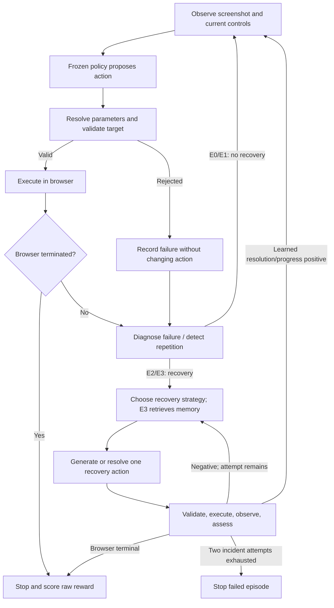

# Why completion is low: whole-loop diagnosis

All **120 scheduled episodes ran**. Each system was tested on 30 task-reset
pairs. Completion is low because the systems make unsuitable actions or stop
after repeated rejection; the machine is not running out of capacity.

This analysis uses the frozen interface-v2 evidence. It changes no predictions,
prompts, budgets, memory or recorded scores.

## The actual execution path

E0 parser failures and E1's repetition guard are additional stopping conditions.
An opaque browser termination can represent success **or failure**. The scorer
correctly requires termination without truncation and raw reward exactly 1.0.

## Where the episodes stop

| System | Observed stopping reasons | Maximum requests / 30 | Maximum model calls / 102 | Maximum seconds / 600 |
|---|---|---:|---:|---:|
| E0 | 7 parser/policy stops; 23 browser terminals | 1 | 1 | 3.64 |
| E1 | 30 repeated-action loop stops | 3 | 6 | 4.01 |
| E2 | 8 recovery-budget stops; 22 browser terminals | 3 | 5 | 7.49 |
| E3 | 11 recovery-budget stops; 19 browser terminals | 3 | 9 | 11.10 |

There were no infrastructure failures or timeouts. The large overall action,
model-call and time allowances were never approached. Simply increasing them
does not address the observed failures.

## 1. The trained normal-action path cannot get started

E1 selected NAVIGATE in all 90 proposals. Its parameter provider could not
resolve a permitted destination, so **zero browser actions executed**. After
three repetitions on unchanged state, the loop guard stopped each episode.
E2/E3 share this initial policy, so each starts with the same rejected action.

The first-action probability is weak, rather than near-certain: NAVIGATE ranges
from 0.301 to 0.332 across the 30 resets. Mean probabilities are NAVIGATE 0.321,
CLICK 0.306, SCROLL 0.294, TYPE 0.026 and SELECT 0.026. The runtime uses the
checkpoint's argmax; existing parity checks preserve these predictions. These
facts are consistent with poor policy transfer to this benchmark, but do not
identify the exact training or representation cause.

The unchanged trained pre-action route does not ingest rejection feedback as
a new reasoning conversation. Repeating it on the same observation does not
teach it that the previous NAVIGATE was impossible. A fallback actor or masked
argmax would change the registered policy; it cannot be silently called an
interface repair or reported as the existing E1.

## 2. The generated actor skips task preparation

The raw E0 responses contain 27 CLICK actions and three missing action types.
E2 generated 30 CLICK and four SELECT actions; E3 generated 32 CLICK and ten
SELECT actions. **None of these generation paths proposed TYPE in this run.**

For login, E0/E2/E3 clicked Login before entering credentials. The browser
terminated unsuccessfully, so the runner correctly stopped; it is not allowed
to keep acting in a terminated task. E2 likewise submitted password forms
immediately. E3 first clicked the verification field, then Submit, but never
typed. Radio/checkbox tasks also received incompatible SELECT proposals or
premature Submit clicks.

This is the immediate reason those families scored zero. The control projection
already provides labels, field state and capabilities; the existence of correct
inputs does not ensure the small frozen generator chooses the right next step.
Instruction/representation changes might help, but their effect requires a
controlled development check. Automatic TYPE insertion or SELECT-to-CLICK
replacement would alter the selected action and obscure the measured behavior.

## 3. Recovery resolution is also being used as progress

All **54 learned recovery assessments were negative**: 26 in E2 and 28 in E3.
This includes the last assessments in all **12 successfully completed E2/E3
episodes**. Browser completion still counts correctly because terminal handling
precedes the learned-negative continuation rule.

There is a specific controller limitation: PC-01 has one executed-recovery
outcome head. The [runtime mapping](../src/web_agent/runtime/qwen2vl_pc01.py)
sets both `predicted_failure_resolved` and `predicted_progress` from the same
probability at threshold 0.5. They are **not independent predictions**. A useful
intermediate action cannot obtain a separate learned progress signal from this
mapping.

The [episode controller](../src/web_agent/runtime/episode.py) returns to normal
acting only when either flag is positive. Otherwise it permits another recovery
attempt, then stops at two incident attempts. Since both flags were always
negative, no episode returned to normal acting after a nonterminal recovery.
The episode allowance of four recovery attempts did not provide four attempts
inside the first incident.

This faithfully implements the frozen protocol, but is a poor fit for long
corrections when a recovery step and a recovery attempt are effectively the
same unit. A login correction can require typing two fields and submitting.
The saved run does **not** establish that extra attempts would solve it: the
planner did not propose those TYPE actions in the first place. Both issues
must be addressed separately.

## 4. Memory does not supply the missing correction

All memory delivery and retrieval checks passed. However, the 138 candidate
slots contained no TYPE or SELECT example, despite 522 such stored examples.
All 1,974 records lack corrective values and reflections. The same NAVIGATE
example ranked first for all 39 NAVIGATE queries. See the detailed
[P4 diagnosis](TABLE2_P4_USEFULNESS_DIAGNOSIS.md).

Improving only memory admission cannot repair the baseline's absent typing or
the controller's progress semantics. It may reduce harmful context or cost,
but no positive completion increment has been demonstrated.

## Improvement plan without retraining

The next useful work is a **separate development revision of the action and
continuation interfaces**, before another memory experiment or final run.

1. **Establish a functional generated next-step actor.** On the existing
   development tasks, test an explicit, balanced description of executor
   semantics: CLICK activates controls including radio/checkboxes, TYPE enters
   text, SELECT operates a dropdown. Preserve exact values and one action per
   proposal. Verify that the model itself emits preparation steps before
   submission. Change one prompt/interface feature at a time, with frozen
   weights and decoding; retain failures. Do not inject benchmark answers or
   rewrite a model action. This is a candidate experiment, not a proven fix.

2. **Give intermediate progress its own honest meaning.** Retain the learned
   assessment unchanged, but design a separately logged observable-step-progress
   record using executed-action effects and current control state. It must not
   read reward, claim task success, or treat arbitrary page change as progress.
   Test a bounded continuation policy for useful nonterminal steps under fixed
   total budgets. Declare this as a protocol revision, apply shared behavior
   equally to E2/E3, and keep diagnosis, recovery and learned assessment active.
   Do not retroactively change the current two-attempt rule or final scores.

3. **Reassess P4 only after the baseline can execute multi-step tasks.** Test
   applicable versus unhelpful memory context using the existing frozen store
   and development tasks. Retain E2 when advice lacks the required evidence.
   No missing values/reflections may be fabricated. Any change to retrieval or
   admission needs its own frozen profile; the current 120 outcomes cannot be
   used to select a winner.

E1's standalone weakness remains a separate limitation. Under its current
frozen argmax definition, this analysis does not supply a justified fix that
guarantees higher E1 completion. The thesis contrasts can still measure the
benefit of P1 and P4 over that baseline; they cannot claim an independent gain
from every pillar. New final evaluation should wait for a functional, audited
development loop, with all method changes declared in advance.

## Evidence

- [Per-system stopping and prediction summary](/home/aiub/kiyas/table2-evidence/miniwob-interface-v2-loop-diagnosis/summary.json)
- [All 120 episode traces](/home/aiub/kiyas/table2-evidence/miniwob-interface-v2-loop-diagnosis/episode-traces.json)
- [Reproducible analysis script](../scripts/analyze_table2_episode_loop.py)
- [Unchanged final results](TABLE2_MINIWOB_INTERFACE_V2_RESULTS.md)

The analysis verifies every consumed evaluation file against the completed
archive manifest. It performs no new model inference, browser episode, memory
write, package change or dataset review.
