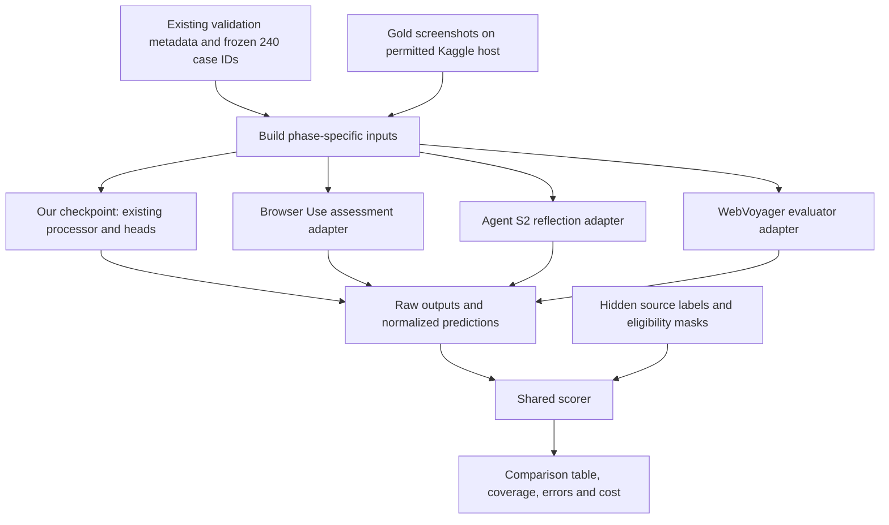

# Task 1: agent-component comparison architecture and data example

Date: 2026-09-14. Status: design only; no new inference or image access.

## Purpose

Test Browser Use, Agent S2 and WebVoyager's relevant assessment components on
the same small portion of our recorded dataset as our frozen trained model.
Focus on interaction outcome and observed recovery outcome; retain failure
category, strategy, storage decision, action and grounding where comparable.
This is an offline comparison, not execution of the full agents on websites.

The existing [240-case selection](TASK1_MINI_DATASET_PILOT.md) is a balanced
validation pilot: 40 cases per recorded action class, 235 task IDs, and 120
linked recovery cases. Do not regenerate the selection. Validation used for
checkpoint selection is not an independent final test.

## Architecture



Use one small batch runner and three adapters. Reuse the existing recovery
transition builder and trained-model processor. No browser coordinator, website
hosting, new agent framework or retraining is needed for this design.

Input image references are resolved to actual image content only on the permitted
execution host. Passing file-path strings to a vision model is not image input.
No upload to an external API is implied by this plan; any such transfer needs
explicit authorization. Image availability has not yet been verified.

## Comparator contracts

| Row | Existing component | Required adaptation and boundary |
|---|---|---|
| Our trained model | Frozen outcome, failure and recovery heads | Preserve the selected checkpoint's existing processor and inputs. Pin one checkpoint before comparative inference; the mini/full and PC-01/PC-02 discussion is not an implemented switch. |
| Browser Use, adapted assessment | `evaluation_previous_goal` and action context | Reconstruct recorded previous-action context without a live DOM. Keep evaluation enabled; map its assessment to the declared schema. |
| Agent S2, adapted reflection | Reflection on task/subtask history | Supply only available completed history and screenshots. Do not fabricate plans, DOM trees or prior experience. Full S2 memory/planning is not exercised by an isolated reflection call. |
| WebVoyager, adapted evaluator | Screenshot-based task-success evaluator | Its native target is whole-task success. Explicitly change the question to action-transition or recovery-transition assessment. This is a method adaptation, not a file-format conversion alone. |

Sources:
- [Browser Use output contract](https://github.com/browser-use/browser-use/blob/main/browser_use/agent/views.py)
- [Agent S2 reflection/history source](https://github.com/simular-ai/Agent-S/blob/main/gui_agents/s2/core/knowledge.py)
- [WebVoyager evaluation source](https://github.com/MinorJerry/WebVoyager/blob/main/evaluation/auto_eval.py)

Pin repository revisions, exact retained/modified prompts, backend model IDs,
decoding and parser rules before scoring. These are selected candidates, not
three verified runnable adapters. If a component requires unavailable context,
record the incompatibility instead of inventing that context.

Use one shared compatible vision-language backend for the three external
components if feasible, to compare their assessment methods. Keep their actual
method-specific instructions; replacing them all with one identical prompt
would not constitute three distinct agent methods. Backend compatibility and
resource availability remain to be checked. Report our task-specific training
versus their prompted use explicitly.

## What each system receives

Produce separate requests for separate prediction phases. The input builder uses
an allowlist; it never forwards an entire source row or the selection manifest.

| Request | Permitted input | Hidden answers/future information |
|---|---|---|
| Interaction assessment | Task/domain, before and after screenshots, recorded action type | Outcome label, failure category, recovery labels, storage flag, collection confidence and sampling stratum |
| Recovery-strategy prediction, optional | Completed failed-action context | Reference strategy, next action and post-recovery screenshot/outcome |
| Recovery assessment | Task/domain, failure-state screenshot, actual linked recovery action, post-recovery screenshot | Recovery-success label and downstream events; reference strategy is not a default input |
| Storage prediction, optional | Only the phase inputs used by the trained memory head | Storage target and any other reference label not part of that input contract |
| Action/grounding prediction, optional | Task/domain and pre-action screenshot | Recorded action type, target bbox, after screenshot and outcome |

Any extra input must be available to every compared system under the same task
definition. Keep the trained input contract unchanged. Reference bboxes remain
scoring-only in the initial assessment comparison. Missing action values stay
null; do not infer them from source labels or insert plausible values.

The dataset's recorded-attempt flag is not independently labelled recovery
necessity. Do not turn it into a claim about whether recovery should occur.

## Real source example, metadata only

This is an abbreviated actual selected validation record, not a new prediction.
It preserves the source's generic goal. Neither screenshot was opened, so this
example demonstrates the schema, not visual confirmation of its labels.

```json
{
  "meta": {
    "sample_id": "gold_v16_40k_000063__step_0000",
    "task_id": "gold_v16_40k_000063",
    "step_index": 0
  },
  "inputs": {
    "state_before": "images/gold_v16_40k_000063/before_0001.png",
    "state_after": "images/gold_v16_40k_000063/after_0001.png",
    "task_description": "Look for the requested site information for the current task.",
    "website_domain": "dzen.ru"
  },
  "labels": {
    "action_type": "CLICK",
    "outcome_label": "FAILURE",
    "failure_type_4": "ACTION_MISMATCH",
    "recovery_strategy": "BACKTRACK",
    "recovery_success": false,
    "memory_update_flag": true,
    "action_target_bbox": {
      "x": 631.09375,
      "y": 79.0,
      "width": 54.765625,
      "height": 20.0
    }
  }
}
```

The input adapter extracts the recorded action as context for assessment. The
other labels above are never sent as answers. For action prediction, even the
recorded action is hidden.

### Assessment request sent through each adapter

```json
{
  "schema": "task1.assessment-input.v1",
  "case_id": "gold_v16_40k_000063__step_0000",
  "phase": "interaction_assessment",
  "task_description": "Look for the requested site information for the current task.",
  "website_domain": "dzen.ru",
  "before_image": "images/gold_v16_40k_000063/before_0001.png",
  "executed_action": {"type": "CLICK", "value": null},
  "after_image": "images/gold_v16_40k_000063/after_0001.png"
}
```

The common question is: assess the recorded action's outcome using this observed
transition. The per-agent instruction and output mapping are declared separately.
The case ID is for bookkeeping and need not appear in the model prompt.

### Separate recovery request for that case

The existing builder links source step 0 to step 1. Its actual next action is
NAVIGATE. The recovery transition uses step 0's after-state and step 1's
after-state, not the original before/after pair.

```json
{
  "schema": "task1.assessment-input.v1",
  "case_id": "gold_v16_40k_000063__step_0000",
  "phase": "recovery_assessment",
  "dependency_id": "gold_v16_40k_000063__step_0001",
  "task_description": "Look for the requested site information for the current task.",
  "website_domain": "dzen.ru",
  "before_image": "images/gold_v16_40k_000063/after_0001.png",
  "executed_action": {"type": "NAVIGATE", "value": null},
  "after_image": "images/gold_v16_40k_000063/after_0002.png"
}
```

Build recovery links from the full permitted validation metadata before filtering
to the selected case IDs. Dependency rows are not extra scored examples.

### Normalized output example

This is illustrative only; no external agent has generated it. Keep separate
output records per phase and preserve the full raw response alongside them.

```json
{
  "case_id": "gold_v16_40k_000063__step_0000",
  "system": "browser-use-adapted",
  "phase": "interaction_assessment",
  "parse_status": "valid",
  "predictions": {
    "outcome_label": "FAILURE",
    "failure_type_4": null
  },
  "capabilities": {
    "outcome_label": "adapted",
    "failure_type_4": "unsupported"
  },
  "raw_response": "The observed action did not achieve its intended effect."
}
```

Null never means a correct negative answer. Unsupported capability, abstention,
malformed output and runtime error receive distinct statuses. Do not force a
failure category out of an unsupported native output using a hidden second LLM.
If an explicit category prompt is added, declare and evaluate that adaptation.

## Scoring and reporting

- Interaction outcome: 240 cases; MCC, balanced accuracy and class recall.
- Recovery outcome: 120 linked attempted cases; MCC and macro-F1.
- Failure category and strategy: optional shared supported outputs, with stated
  masks, label sets and denominators. Strategy matching is annotation agreement.
- Memory storage: optional separate endpoint; no claim of retrieval benefit.
- Action: optional pre-action pass covering all six classes.
- Grounding: optional on eligible boxes only, with verified image dimensions and
  coordinate conversion. Do not convert point-only outputs into invented boxes.
- Invalid responses remain visible and cannot improve scores through silent
  deletion. Freeze their treatment; report prediction coverage alongside scores.
- Pair comparisons by case and account for task groups when estimating intervals.
  Report latency/model calls and the enriched sampling distribution.

Proposed main table: system + backend, adaptation/training status, outcome MCC,
recovery-outcome MCC, failure macro-F1 where supported, coverage and cost. Put
storage/strategy and action/grounding in supporting tables. No result cells are
filled until that exact system has been scored on the selected cases.

## Implementation checklist

- [x] Inspect source schema and an actual selected recovery pair without images.
- [x] Document pipeline, phase boundaries and sample payloads.
- [ ] Pin our checkpoint, three external components and their backend identities.
- [ ] Freeze each component's adaptation and supported-output matrix.
- [ ] Implement allowlisted input views and thin adapters in the existing runner area.
- [ ] Verify image references/runtime on the permitted host.
- [ ] Check label isolation, recovery linkage and parsers on separate development cases.
- [ ] Freeze prompts, scoring and all exclusion rules before pilot outcomes.
- [ ] Run the four systems on the same mini subset; save every raw response.
- [ ] Produce comparison tables and document unsupported capabilities/limitations.

The next implementation step is the input builder and Browser Use adapter.
No public-benchmark evaluation, full browser-agent integration or package/model
installation is part of this architecture task.
