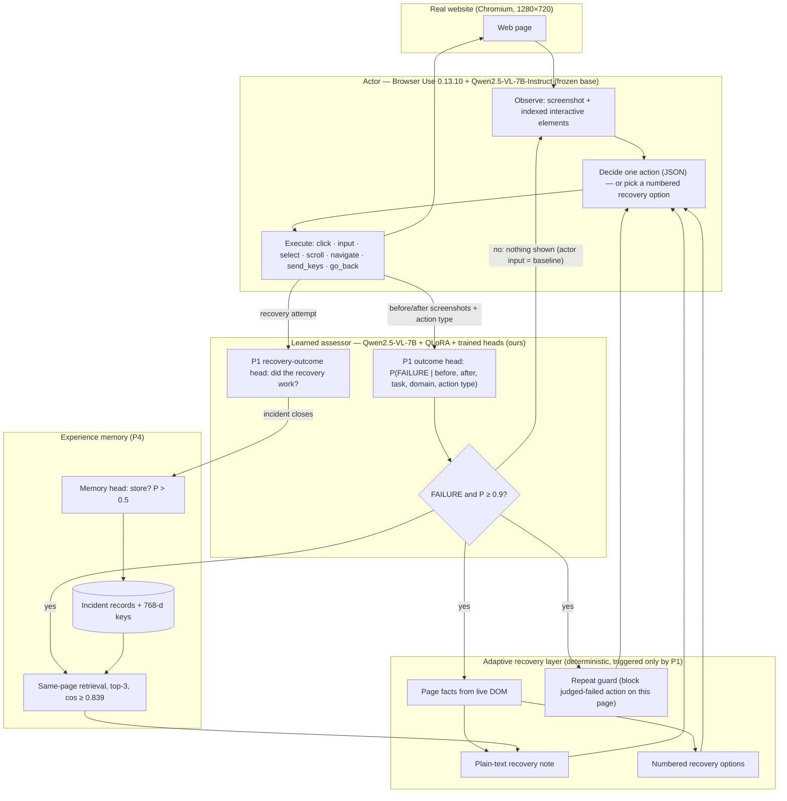

# Failure-aware web agent: method reference for the methodology chapter

Status: 2026-10-01 (lab session end). This document records the agent exactly as
implemented in this repository, with every setting and the evidence behind each
design decision, so the methodology chapter can be written from it. Numbers in
§8 are **development checks**, not the final evaluation (see §9).

Working thesis title (fixed by the author): *A multimodal framework for failure
detection, adaptive recovery, and experience memory in autonomous web agents.*

---

## 1. Problem and design principle

An open-source web agent completes many tasks on real websites, but when it
fails it usually does not notice: it repeats an action that has no effect
(scrolling past the end of a page, clicking a text box again, re-typing the same
query) until its step budget runs out. Our trained multimodal model is strong at
judging whether an executed step succeeded but weak at choosing actions
(Table 1: action macro-F1 0.318). The framework therefore separates roles:

| Role | Component | Trained by us? |
|---|---|---|
| Perceive the page and choose/execute every action | Browser Use 0.13.10 driven by Qwen2.5-VL-7B-Instruct (frozen base) | No |
| Detect failed steps (P1 outcome head) | Qwen2.5-VL-7B + trained heads, checkpoint `71f867cc…` (PC-02, epoch 0, seed 42) | Yes |
| Verify a recovery attempt (P1 recovery-outcome head) | same checkpoint | Yes |
| Decide which incidents to remember (P4 memory head) and embed them | same checkpoint | Yes |
| Turn a detected failure into usable help (recovery layer) | rule-based, page-grounded (§4) | No (deterministic) |

**Invariant:** unless the assessor reports a *confident* failure, the actor
receives exactly the same input, at the same moment, as the baseline agent. All
help is triggered by a learned failure detection; nothing is shown otherwise.

The actor always selects the action. The recovery layer can (i) add a plain-text
note, (ii) offer a numbered list of concrete actions for the actor to choose
from, and (iii) refuse to execute an exact repeat of an action the assessor has
already judged failed. It never substitutes an action of its own.

### 1.1 Architecture overview (Figure)



Text version (for slides or plain viewers):

```
 Real website ──screenshot+elements──► ACTOR (Browser Use + Qwen2.5-VL-7B base) ──action──► Real website
      │                                        ▲        ▲        ▲
      │ before/after                           │ note   │ options│ block
      ▼                                        │        │        │
 P1 ASSESSOR (Qwen2.5-VL-7B + QLoRA heads) ──FAILURE ≥ 0.9──► RECOVERY LAYER (page facts, note,
      │  outcome / recovery-outcome / memory heads                 options, repeat guard)
      │                                                               ▲
      └── incident closes ──► P4 MEMORY (memory head stores; same-page retrieval) ─┘
```

## 2. Components and where they live in the code

| Component | File |
|---|---|
| Episode loop, gating, repeat guard, recovery options | `src/web_agent/eval/task2/live.py` |
| Actor wrapper (Browser Use custom LLM), overlap, guard regeneration, option choice | `src/web_agent/eval/task2/native_model.py` |
| Model worker: actor generation, P1 assessment, P4 memory ops, prompt assembly | `src/web_agent/eval/task2/model_worker.py` |
| Transition contract, P1 assessor bridge, recovery note text | `src/web_agent/eval/task2/assessment.py` |
| Live website environment: reset, observe, score, page facts | `src/web_agent/eval/task2/web_worker.py` |
| P4 experience memory store and retrieval | `src/web_agent/memory/experience.py` |
| Protocol settings | `configs/eval/task2/qwen25_v1.json` |
| Task suite | `configs/eval/task2/web_tasks_v1.json` (v2 pending, §7) |
| Single runs / paired comparison | `scripts/run_agent.py`, `scripts/compare_agents.py` |
| Tests | `tests/task2/` (85 passing) |

### 2.1 The trained multimodal assessor (exact configuration)
Source: the selected checkpoint's saved config
(`best_e0_outcome-mcc0.678.ckpt`, sha `71f867cc…`) and `src/web_agent/models/`.

| Part | Setting |
|---|---|
| Backbone | Qwen2.5-VL-7B-Instruct (revision `cc59489…`), 4-bit QLoRA, bfloat16 compute |
| LoRA | rank 16, alpha 32, dropout 0.05, on q/k/v/o and gate/up/down projections |
| Image input | before and after screenshots, Qwen2.5-VL processor with 50,176–200,704 pixels per image |
| Text input | `"{instruction} current_task: {task} \| domain: {domain} \| executed_action: {type}"` (≤ 128 tokens); the action *value/target* is not an input |
| Pooling | last token of the backbone (hidden 3,584) → adapter Linear(3,584→768) + LayerNorm + dropout 0.1 |
| Causal routes | *pre* route: before image + "Choose the next action…" (action head); *post* route: before + after images + executed action type + "Assess the result by comparing the page before and after execution." (failure, memory heads); *recovery* route: failure state + post-recovery state + "Assess whether the executed recovery succeeded…" (recovery-outcome head) |
| Task adapters | residual bottleneck adapters (768→128→768, GELU, LayerNorm, dropout 0.1) per task: policy, diagnosis, memory, recovery, grounding |
| P1 failure head | trunk Linear(768→256)+ReLU+Dropout(0.3); outputs outcome (2), failure type (4: none, action mismatch, perception error, loop), confidence (1), recovery strategy (6), needs-recovery (1) |
| P1 recovery-outcome head | same trunk; 1 logit (success if > 0) |
| P4 memory head | same trunk; memory flag (1 logit, store if sigmoid > 0.5) + recovery strategy (6). Its 768-d input (memory task-adapter output on the post route) is the memory key |
| P3 action head | action type (6) + bounding box — trained but **not used** at run time (macro-F1 0.318) |
| Loss weights | outcome 0.22, failure type 0.18, action type 0.15, bbox 0.10, memory 0.10, recovery outcome 0.09, recovery 0.05, confidence 0.05, calibration 0.05, needs-recovery 0.04, supervised contrastive 0.04; label smoothing 0.1; uncertainty-based dynamic weighting; class weights for action and failure type |
| Data | Web-Gold-40K v2.8: 24,107 training cases (23,499 original + 608 retry/abort supplement), 7,861 validation cases, 1,858 attempted-recovery validation cases; domains from the author's dataset (305) |
| Training / selection | up to 10 epochs, early stop on outcome MCC (patience 3); selected epoch 0, seed 42 |
| Validation (Table 1) | outcome MCC 0.678, failure macro-F1 0.839, failure-type macro-F1 0.542, recovery-strategy macro-F1 0.493, recovery-outcome MCC 0.852 (acc 93.5 %), memory MCC 0.695 (acc 85.8 %, macro-F1 0.846) |

### 2.2 Run-time processes and data flow
- **Orchestrator** (`scripts/run_agent.py` / `compare_agents.py`, isolated
  Browser Use environment): runs the episode loop (`live.py`) and Browser Use.
- **Model worker** (`model_worker.py`, project environment, GPU): one process
  holding the actor (frozen base) and the assessor (trained heads); JSON
  requests over stdin/stdout: `generate` (actor), `assess` (P1), `experience`
  (memory key + P(store) + retrieval), `experience_write`.
- **Web worker** (`web_worker.py`, Playwright): launches Chromium with a CDP
  port; `reset` opens the task's start page, `observe` saves the screenshot used
  by P1, `score` applies the hidden completion rule, `facts` reads page facts.
  Browser Use attaches to the same Chromium over CDP and performs the actions.
- **Memory store** on disk: `records.jsonl` + `embeddings.npy` per store
  directory; a paired run shares one store across its C episodes.
- Safety on the GB10 unified-memory host: CUDA cache released after each
  model call; model calls refused below 16 GB free host memory.

### 2.3 Actor configuration (identical for A and C)
Browser Use 0.13.10, `use_vision=True`, `max_actions_per_step=1`,
`max_failures=5`, `max_history_items=6`, no thinking field, no judge, no
message compaction; allowed actions: click, input, select_dropdown, scroll,
navigate, send_keys, go_back, done; navigation restricted to the task's
domain. LLM: Qwen2.5-VL-7B-Instruct frozen base, greedy decoding, ≤ 512 new
tokens, repetition penalty 1.05. Step limit 15. The only output post-processing
is Browser Use's own rule that removes a Markdown fence around the whole JSON.

## 3. One agent step (system C, recovery mode v3.3)

```
for step in 1..15:
    Browser Use captures the page (screenshot + indexed interactive elements)
    actor call:
        await the previous step's assessment task            # overlap (§3.1)
        if a recovery offer exists: ask actor to pick an option (§4.3)
        else: Browser Use prompt (+ recovery note if any) -> one action (JSON)
              if the action repeats a blocked action: ask again (≤2), never substitute (§4.2)
    Browser Use executes the action
    environment: score (hidden from agent), screenshot ("after")
    start assessment task (runs while the next page is being captured):
        P1 on (before, after, task text, domain, action type)
        if FAILURE and P(failure) ≥ 0.9 (or recovery-outcome FAILURE):
            block the action on this page
            P4: embed, query same-page memory, memory head P(store)
            page facts from the live DOM (§4.1)
            build recovery note + options for the next actor call
        incident bookkeeping; P4 write when an incident closes
```

### 3.1 Assessment overlap (timing parity)
Browser Use captures the next page at the start of its step, before calling the
LLM. The assessment of step *t* runs as an asynchronous task and the actor call
of step *t+1* waits for it only after the page has been captured. The actor
therefore sees the page at the same moment as the baseline. Evidence: in the
synchronous design (web-v2) the 20–40 s assessment delay let pages settle
(Browser Use's interaction highlight faded, image thumbnails finished loading;
screenshots compared), and the actor then emitted invalid output on three tasks
the baseline completed (Alan Turing ×2, photosynthesis), with no advice sent.

### 3.2 Learned failure detection (P1)
- Input: before/after screenshots (1280×720), task description, website domain,
  executed action type. Decision rules unchanged from Task 1: outcome = argmax;
  recovery outcome = logit > 0.
- **Trigger gate:** recovery opens only if outcome = FAILURE and
  P(FAILURE) ≥ 0.9 (`recovery_trigger_probability`). Chosen on the 20-task
  development run: correct TYPE steps scored 0.55–0.85 (typing changes few
  pixels, the same "small change = failure" bias seen on MiniWoB) and every
  non-terminal false alarm was < 0.9, while genuine first failures were
  0.95–1.00. In web-v2 the gate suppressed 9 uncertain failures in 7 episodes,
  all of which completed.
- Live precision (web-v2, ours): on completed episodes only 2 of 40
  non-terminal steps scored ≥ 0.9, both genuine failures; in failed episodes the
  first confident failure arrived at steps 0–2 for arXiv, Debian, EPA, TED, bank
  holidays and at step 9 for IETF.
- Only the outcome and recovery-outcome heads drive behaviour. Failure-type
  (macro-F1 0.542) and strategy (0.493) predictions are logged, never shown to
  the actor: in web-v2 a wrong "PERCEPTION_ERROR / REPLAN" diagnosis sent the
  actor into a 13-click loop on a task the baseline solved by retyping.

## 4. Adaptive recovery (v3 → v3.3)

### 4.1 Page facts (`web_worker.page_facts`)
Read from the live DOM after a confident failure; the only task input is the
goal text (the completion rule is never read):
- scroll position (at top / at bottom of the page);
- the focused text field, its value, whether it is inside a form and the form's
  submit control;
- visible site-search boxes;
- **goal-matching links**, including links hidden in closed menus: link text and
  URL path are tokenised and lightly stemmed; goal words that are stop words or
  part of the site's host name are dropped; each remaining goal word is weighted
  by its rarity among the page's links, w = log((1+N)/(1+n_w)); the top 3 links
  by summed weight are returned.

### 4.2 Recovery note and repeat guard
- **Note** (plain text, appended after Browser Use's prompt): the failed action
  in words, P1's confidence, "the page did not change", page facts (bottom of
  page, unsubmitted field, goal-matching links with "hidden" flags, search box),
  up to three P4 experiences, and up to three non-scroll steps already judged
  successful ("do not redo"). JSON advice was ignored by the actor in web-v2;
  plain text is used instead.
- **Repeat guard:** an action judged failed is blocked on that page. Identity:
  same action type and element XPath (plus the same text for TYPE); for SCROLL
  the same direction, only when the page did not move; for NAVIGATE/PRESS_KEY
  the same value. Actions Browser Use failed to execute (e.g. a file-download
  link) are blocked too. Blocks are scoped to the page path (query strings
  ignored) and cleared when the path changes. If the actor proposes a blocked
  action it is asked again (≤ 2 regenerations, "PROPOSAL BLOCKED, NOT EXECUTED:
  …"); if it insists, the action runs (no substitution, no extra failure).

### 4.3 Recovery options (actor chooses by number)
Evidence for this step: after the note broke a loop, the actor often knew what
to do ("search the site") but could not produce the right Browser Use action
JSON. After a confident failure the actor is now asked a short question
(screenshot + task + note + 2–5 numbered options + "0. none, I decide"), and
answers with a number. The chosen option becomes Browser Use's own output and
is executed by Browser Use. Options are generated from page facts, minus any
blocked action:
1. open each goal-matching link (top 3) — `navigate`;
2. search the site for the goal phrase (quoted phrase in the goal, else its
   content words without site name and stop words) — `input` into the search
   box, followed by a "press Enter" option, followed by "open a goal-matching
   link on the results page" (facts re-read on the results page);
3. if the search box is off-screen (Browser Use lists only elements near the
   viewport): "scroll to the top and search", then the search option;
4. press Enter to submit a filled field; 5. scroll to top; 6. go back.
Answer "0" returns to the normal Browser Use prompt with the note.

### 4.4 Recovery budget
2 recovery attempts per incident; up to 15 per episode (i.e. any confident
failure in a 15-step episode can receive help). Each recovery attempt is
re-assessed by the recovery-outcome head (MCC 0.852).

### 4.5 What the actor actually receives (examples from the logs)
**Recovery note** (IETF, v3 check, step 2; appended after Browser Use's prompt; the v3 note also listed "Already done successfully: scroll down; scroll down", which v3.1+ omits for scrolls):
```
FAILURE MONITOR: your last action (scroll down) did not make progress (learned confidence 0.98).
- Repeating exactly that action will be blocked.
- You are at the bottom of the page: there is nothing further down.
- Links on this page whose words match the task (hidden = inside a closed menu; any of them can be opened with navigate):
  * 'RFC Editor' -> https://www.rfc-editor.org/about/rfc-editor/ (hidden)
  * 'Independent Submissions Editor' -> https://www.rfc-editor.org/authors/rfc-independent-submissions/ (hidden)
  * 'About RFCs' -> https://www.ietf.org/process/rfcs/ (hidden)
- This page has a search box ('Search the email archive').
Choose your next action yourself from the current page.
```
**Option question** (TED, v3.1, step 2; separate short request: screenshot +
text):
```
Task: Open the TED page that lists talks.
FAILURE MONITOR: your last action (scroll down) did not make progress (learned confidence 0.98). …
Recovery options for the next action:
1. Open the link 'TED TalksBrowse the library of TED talks and speakers' (https://www.ted.com/talks)
2. Open the link 'TED Playlists100+ collections of TED Talks, for curious minds' (https://www.ted.com/playlists)
3. Go back to the previous page
0. None of these; I will choose my own action.
Reply with only the number of the best option.
```
Actor reply: `1` → Browser Use executes `navigate(https://www.ted.com/talks)`.

**Guard message** (when a blocked action is proposed):
`PROPOSAL BLOCKED, NOT EXECUTED: '<action in words>' was already tried on this
page and did not make progress. Choose a different action.`

## 5. Experience memory (P4)
- **What is stored:** one record per incident — task goal, page URL, failed
  action (type, element, value), logged diagnosis, every recovery attempt with
  its assessed outcome, and whether the incident was resolved. Resolved and
  unresolved incidents are both eligible ("this did not work" is useful).
- **Storage decision:** the trained memory head (Table 1: accuracy 85.8 %,
  macro-F1 0.846, MCC 0.695 at the selected epoch; 0.695–0.708 over epochs 0–3;
  majority baseline 62.0 % / 0.383). Stored if P(store) > 0.5.
- **Key:** the checkpoint's 768-d memory embedding of the failed transition.
- **Retrieval:** same page only (host + path), ranked by cosine, top-3, admitted
  if similarity ≥ 0.839 (calibrated), not from the same episode, and at least one
  recorded element label is visible on the current page. Page scoping is used
  because the embedding separates relevant neighbours only weakly (AUC 0.60 on
  training transitions): it was trained for storage, not retrieval.
- Retrieved experiences go into the recovery note; failure-type/strategy fields
  are not shown.
- **Status:** storage runs live (1–4 writes per episode). Reuse was not
  exercised in the development checks: each task ran once with an empty store,
  so 58 of 60 retrieved candidates were excluded as SAME_EPISODE. Reuse is
  measured in the paired run, where repeats share a store.

## 6. Evaluation protocol (paired comparison)
- Systems: **A** = Browser Use alone; **C** = Browser Use + P1 + recovery + P4.
  Same actor, prompts, step limit (15), budgets, viewport, start pages.
- Tasks: real websites from domains in the author's dataset
  (web_agent_gold_v16_500_domain_40k, 305 domains). Completion = the
  environment's URL rule, checked after every step, never shown to the agent.
- Each (task, repeat) is a pair (A, C), run back-to-back; order alternates per
  repeat; a repeat's C episodes share one memory store.
- Analysis: completed counts; discordant pairs (C ✓ A ✗ = helped, A ✓ C ✗ =
  hurt); exact two-sided sign test; recovery rate on baseline failures; harm
  rate on baseline successes.
- Frozen plan: `compare_agents.py freeze` hashes sources and config; `run`
  refuses to start if any frozen file changed; interrupted episodes are moved
  aside, never counted, and rerun. Infrastructure errors are not results.

## 7. Task suite audit (2026-10-01) — to apply before the next run
A live audit (no model) of all 20 tasks found:
- **Scoring too lenient (substring rule):** `wiki/ephemeral` matched
  `wiki/ephemeral_lake` (2 false completions, both for system C — web-v2 C
  is corrected from 21/38 to 20/38, hurt 6 → 7); TED's homepage has 101
  individual-talk links (`/talks/<slug>`) that satisfied `ted.com/talks`;
  Yale, IETF and Stanford sub-pages also satisfied their rules. Fix: exact page
  match (host + path, query/fragment ignored), except whole-site or list goals
  (jQuery API site; arXiv cs.AI list variants).
- **Stale metadata:** Creative Commons target is now `/cc-licenses/`
  (the old URL redirects there); the rule itself was correct.
- **Infeasible or misleading goals** (author decided 2026-10-01: arXiv → add the author "Vaswani et al." to the goal; Debian → reword the goal as a web page listing the ways to download Debian, not an installer file):
  - arXiv paper: searching the title (all fields or title field) does not show
    1706.03762 in the first 50 results; title + "Vaswani" ranks it first.
    Options: add the author to the goal, or use the arXiv ID.
  - Debian distrib: the goal names a "Getting Debian" page, but the link reads
    "Other downloads" and the page title is "Download Debian"; the prominent
    "Download" button is an ISO file. Options: reword the goal, or replace it.
- **Stanford:** its pages never fire `load` within 30 s; `observe` now tolerates
  this (and control-extraction errors), so the task can return.
- Principle: changes are made for task validity, applied to both systems, and
  documented; never because of which system fails.

## 8. Development results so far (not the final evaluation)
**web-v2 (synchronous advice, before v3), 38 pairs:** A 27/38, C 20/38
(corrected), helped 0, hurt 7. Causes: assessment delay (3), misleading
diagnosis labels (3), false completion favouring C (1, now known).

**v3.x checks (C only; baseline results known from web-v2):**

| Version | Rescue set: baseline failed 10/10 (arXiv, Debian, EPA, IETF, TED) | Harm set: baseline succeeds (Alan Turing, photosynthesis, bank holidays, serendipity, jQuery download) |
|---|---|---|
| v3 (overlap, note, guard) | 1/5 (IETF) | 5/5 |
| v3.1 (+ numbered options) | 2/5 (EPA, TED) | 5/5 |
| v3.2 (+ 3 links offered) | 2/5 (IETF, TED) | not rerun |
| v3.3 (+ search plan, off-screen search) | 2/5 (IETF, EPA†) + 1 extra TED sample ✓ | not rerun |
| **Total** | **8/21 rescued (38 %)**; IETF/TED/EPA 8/13; arXiv, Debian 0/8 | **10/10, no harm** |

† EPA's first v3.3 attempt ended in an infrastructure error (observer), rerun.
TED's first v3.3 attempt (false "done" at step 0, no action to assess) counts as
a failure; the TED rerun is an additional sample, not a replacement.

Representative rescues (all actions chosen by the actor):
- IETF: P1 0.98 on a futile scroll → note listed the hidden "About RFCs" link →
  actor navigated → completed in 5 steps.
- TED: P1 0.98 → option "1. Open the link 'TED Talks'" → actor answered 1 →
  completed in 4 steps.
- EPA: P1 1.00 at page bottom → "scroll to top and search for 'climate
  change'" → type → Enter → later "Open the link 'Climate Change'" → completed.

## 9. Threats to validity and how the final evaluation addresses them
- **Design on test tasks:** v3–v3.3 were developed while observing these 10
  tasks. The final evaluation must therefore report a **held-out task set**
  (new tasks fixed before any run) separately from the development tasks.
- **Small samples / actor stochasticity:** the same version rescues a task in
  one run and not the next (page variation under greedy decoding); use ≥ 2
  repeats and paired tests.
- **Scope of recovery:** failures that produce no executed action (false "done"
  at step 0, invalid output format) cannot be detected by a transition assessor.
  Some tasks need knowledge absent from the page (arXiv ranking, Debian's
  "Other downloads").
- **Rule-based components:** page facts, options and the guard are deterministic
  heuristics; they act only after a learned confident failure. An ablation
  (gate on vs. off) can isolate the contribution of P1.
- **Memory:** storage is validated offline (Table 1); reuse effect is only
  measurable with repeated visits.

## 10. Next steps (planned)
1. Write `web_tasks_v2.json` with exact-page rules and the two decided goals;
   fix the `you` stop word in goal matching.
2. Add ~20 held-out tasks from the dataset's domains (multi-step: search,
   menus), verified live before freezing.
3. Freeze `web-v3`; paired run (≈ 40 tasks × 2 repeats × 2 systems ≈ 16 h,
   resumable over ~3 lab days); report development and held-out sets
   separately, plus memory reuse on repeat 2.
